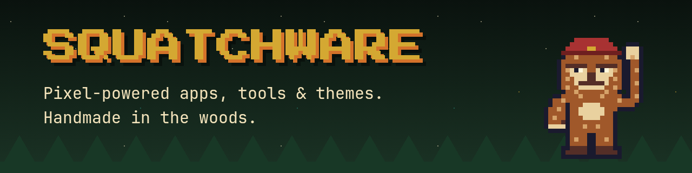

  

**Pixel-powered plugins, themes & TUIs for [Omarchy](https://omarchy.org). Handmade in the woods.**

Serious software, ridiculous packaging. The tools are real; the sasquatch is the joke.

### In the workshop

| | |
|---|---|
| **squatch** | A pixel-sasquatch launcher for Claude Code: fuzzy project picker, resume any session, tmux-aware. |
| **Omasquatch** | A pixel-art mission-control office where sasquatches show you what your AI agents are up to. |
| **HotSquatch theme** | An Omarchy desktop theme in forest green, campfire orange and Guybrush gold. |

Nothing's public yet. Sightings will be confirmed at [squatchware.dev](https://squatchware.dev).

---

Made by [Jim Christian](https://jimchristian.net) · Sightings confirmed on Arch
