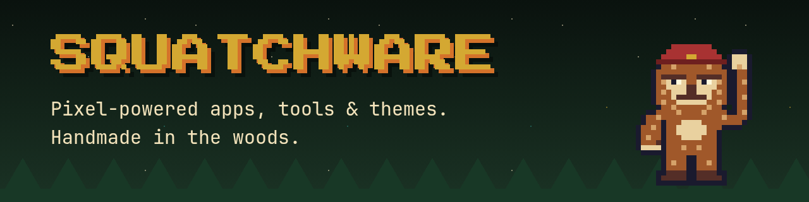

<p align="center">
  
</p>

**Pixel-powered apps, tools & themes. Handmade in the woods.**

### Released

| | |
|---|---|
| **[Squatchware](https://github.com/squatchware/omarchy-squatchware-theme)** | A pixel-art Omarchy theme: night forest, parchment and campfire gold, with a themed lock screen, boot splash, boot menu and screensaver. |
| **[Squatchware Light](https://github.com/squatchware/omarchy-squatchware-light-theme)** | The daylight version: parchment, forest ink and campfire orange. |
| **[omaplex](https://github.com/squatchware/omaplex)** | A floating CRT TV for Plex on Omarchy. It hovers over your tiles and never takes one. |
| **[issquatch](https://github.com/squatchware/issquatch)** | The ISS, tracked from the woods: a floating map with its ground track, live telemetry, and the passes you can actually see. |

```sh
omarchy theme install https://github.com/squatchware/omarchy-squatchware-theme
```

### The Retro Pack

Six Omarchy themes for the machines that raised us, each with a squatch hiding in it. [See them all](https://squatchware.dev/retro/).

| | |
|---|---|
| **[Commodore 64](https://github.com/squatchware/omarchy-c64-theme)** | READY. Light blue on blue and a squatch on tape. |
| **[Apple II](https://github.com/squatchware/omarchy-apple-2-theme)** | Green phosphor text over lo-res colour. |
| **[Teletext](https://github.com/squatchware/omarchy-teletext-theme)** | Page 100: eight colours and chunky mosaic graphics. |
| **[Nixie](https://github.com/squatchware/omarchy-nixie-theme)** | Neon-orange cathodes behind glass, brass and bronze. |
| **[Phosphor Green](https://github.com/squatchware/omarchy-phosphor-green-theme)** | A P1 green monochrome monitor, scanlines and all. |
| **[Phosphor Amber](https://github.com/squatchware/omarchy-phosphor-amber-theme)** | The warm one, easy on the eyes after midnight. |

### Movie Night

Six Omarchy themes for the films we rewound until the tape wore thin, each in dark and light. Original AI-generated
wallpapers, no film frames or logos. [See them all](https://squatchware.dev/movies/).

| | |
|---|---|
| **[Clockstrike 88](https://github.com/squatchware/omarchy-clockstrike-88-theme)** · [light](https://github.com/squatchware/omarchy-clockstrike-88-light-theme) | Midnight asphalt, plasma orange and clock-face gold. |
| **[Crossed Streams](https://github.com/squatchware/omarchy-crossed-streams-theme)** · [light](https://github.com/squatchware/omarchy-crossed-streams-light-theme) | Ectoplasm green and proton orange. |
| **[Digital Frontier](https://github.com/squatchware/omarchy-digital-frontier-theme)** · [light](https://github.com/squatchware/omarchy-digital-frontier-light-theme) | Void black and grid cyan. |
| **[Nostromo](https://github.com/squatchware/omarchy-nostromo-theme)** · [light](https://github.com/squatchware/omarchy-nostromo-light-theme) | Graphite hull, phosphor consoles and bone panels. |
| **[Power Maze](https://github.com/squatchware/omarchy-power-maze-theme)** · [light](https://github.com/squatchware/omarchy-power-maze-light-theme) | Maze blue, power gold and chase red. |
| **[Tears in Rain](https://github.com/squatchware/omarchy-tears-in-rain-theme)** · [light](https://github.com/squatchware/omarchy-tears-in-rain-light-theme) | Rain black and neon. |

### In the workshop

| | |
|---|---|
| **squatch** | A pixel-sasquatch launcher for Claude Code: fuzzy project picker, resume any session, tmux-aware. |
| **Omasquatch** | A pixel-art mission-control office where sasquatches show you what your AI agents are up to. |

More at [squatchware.dev](https://squatchware.dev), and every theme in one place at [squatchware.dev/themes](https://squatchware.dev/themes/).

---

<sub>Made by [Jim Christian](https://jimchristian.net) · Sightings confirmed on Arch</sub>
